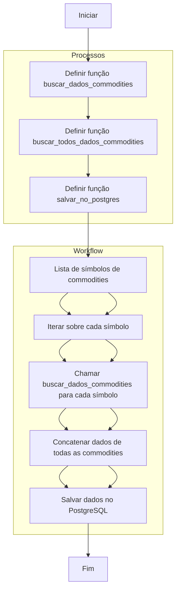

#Data engineer

```mermaid
    graph TD
    A[Iniciar] --> B[Definir função buscar_dados_commodities]
    B --> C[Definir função buscar_todos_dados_commodities]
    C --> D[Definir função salvar_no_postgres]
    D --> E[Lista de símbolos de commodities]
    E --> F[Iterar sobre cada símbolo]
    F --> G[Chamar buscar_dados_commodities para cada símbolo]
    G --> H[Concatenar dados de todas as commodities]
    H --> I[Salvar dados no PostgreSQL]
    I --> J[Fim]

    subgraph Processos
        B
        C
        D
    end

    subgraph Workflow
        E --> F
        F --> G
        G --> H
        H --> I
    end
```